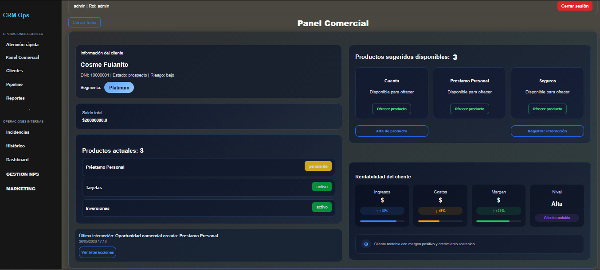
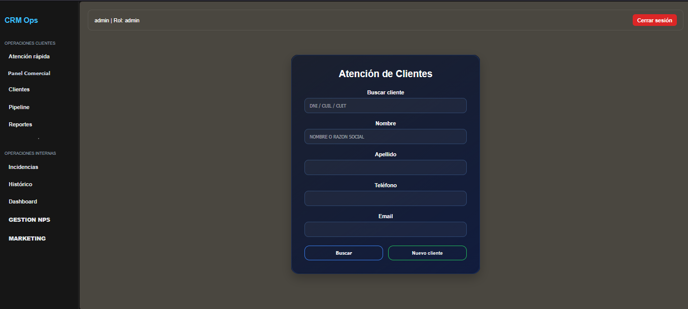
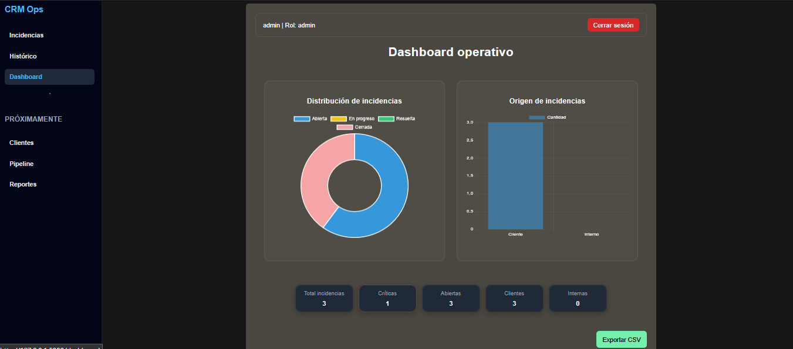
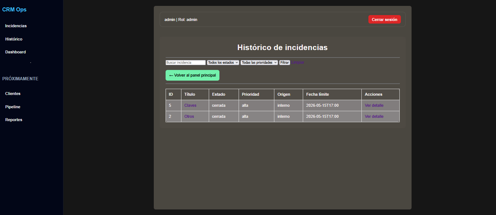
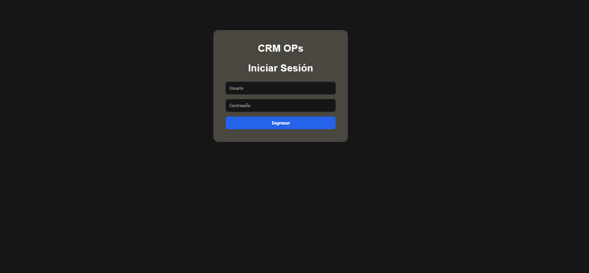
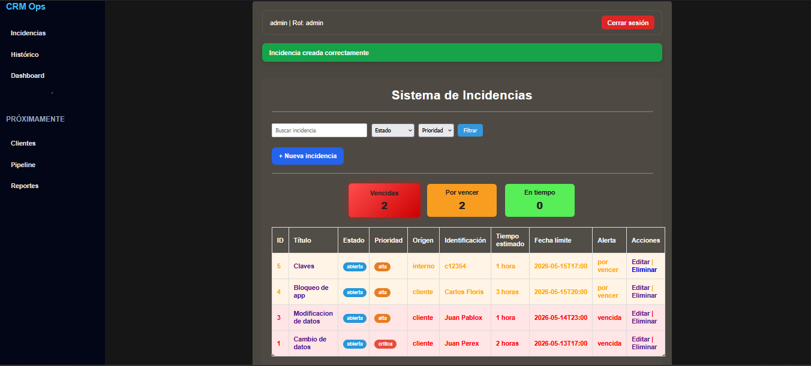

# CRM Ops

Plataforma de gestión comercial y operativa desarrollada en Flask y PostgreSQL.

## Funcionalidades

- Gestión de clientes
- Atención rápida
- Panel comercial
- Pipeline de oportunidades
- Historial de interacciones
- Gestión de productos por cliente
- Validaciones externas (RENAPER, BCRA, ANSES, ARCA)
- Roles de usuario (en desarrollo)
- Trazabilidad de operaciones (en desarrollo)
  
## Tech Stack

- Python
- Flask
- PostgreSQL
- HTML
- CSS
- JavaScript
- Chart.js
- Railway
- Bootstrap

## Roadmap

- Módulo clientes
- Pipeline comercial
- Reportes avanzados
- API REST
- Deploy cloud

## Screenshots

### Panel de atención

### Panel ingreso de datos

### Dashboard

### Histórico

### Login

### Incidencias

## Demo online

https://incident-plataform-production.up.railway.app/

## Demos Access

User: admin
Password: admin123
